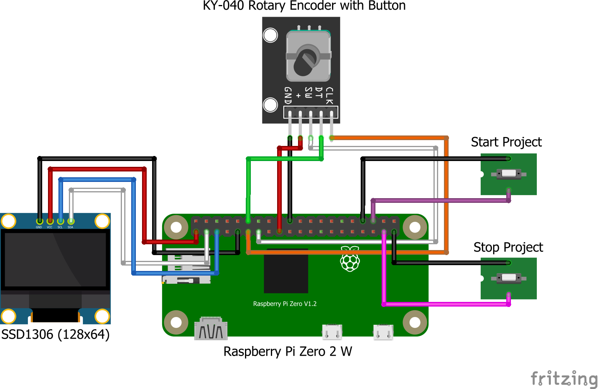

# Raspberry Pi WiFi Manager with OLED & Rotary Encoder

A Python-based project for a Raspberry Pi (specifically tested on Zero 2 W) to scan, connect to, and manage WiFi networks using a USB WiFi adapter (TP-Link Archer T2UV3) connected to an ETH/USB HUB HAT (https://www.waveshare.com/wiki/ETH/USB_HUB_HAT_(B)), an SSD1306 OLED display (0.96" 128x64 4 Pin Yellow-Blue), and a rotary encoder (5 Pin with button) for user interaction.

## Overview

This project provides a user-friendly interface on a small OLED display to:
- Scan for available WiFi networks.
- Filter and display only specified networks (those starting with "QW-" in my case).
- Connect to a selected network using a pre-defined password.
- Display connection status, hostname, and IP address.
- Navigate menus using a rotary encoder.
- Start and stop the main application using dedicated GPIO buttons.

The system is designed to use an external USB WiFi adapter, keeping the onboard WiFi free or disabled. On startup, it clears any previously stored WiFi credentials managed by NetworkManager for a clean slate.

## Features

-   **WiFi Scanning:** Scans 2.4GHz and 5GHz networks using the specified USB WiFi adapter via `nmcli`.
-   **Network Filtering:** Displays only APs with SSIDs starting with a defined prefix ("QW-" in my case).
-   **OLED Display Interface:**
    -   **APs Page:** Lists available filtered WiFi networks.
    -   **STATUS Page:** Shows device hostname, connection status (e.g., "Connecting...", "Connected", "Timeout"), the obtained IP address and the currently connected SSID on separate lines.
-   **Rotary Encoder Control:**
    -   Rotate to scroll through AP lists or menu items.
    -   Press button to select an AP or switch between pages.
-   **Automatic WiFi Connection:** Attempts to connect to the selected AP using a pre-configured password.
-   **Dynamic Hostname:** Sets the device hostname based on the MAC address of the USB WiFi adapter (e.g., `RPi0-XXXX`).
-   **Credential Management:** Clears all known WiFi network profiles from NetworkManager on project start.
-   **GPIO Button Control:**
    -   Dedicated button to start the WiFi management application.
    -   Dedicated button to stop the application and disconnect.
-   **Scrolling Text:** Long SSIDs, hostnames, status messages, or IP addresses automatically scroll on the OLED display for better readability.
    -   Specific scrolling rules for the STATUS page (different length thresholds for hostname, status, IP and SSID).
    -   On the APs page, only the currently selected AP name scrolls if too long; other AP names are truncated.
-   **Modular Codebase:** Organized into separate Python files for configuration, display management, network operations, and GPIO handling.

## Video Demo
[](https://www.youtube.com/watch?v=nlAtluvpgFA)

## Hardware Requirements

-   Raspberry Pi Zero 2 W (or any Raspberry Pi with compatible GPIO and I2C, USB)
-   SSD1306 OLED Display (I2C, 0.96", 128x64 pixels)
-   Rotary Encoder (with integrated push-button, e.g., KY-040)
-   USB WiFi Adapter (Ensure it's compatible with Raspberry Pi OS and NetworkManager. I've used TP-Link Archer T2UV3 and had to recompile drivers for it.)
-   A way to connect the USB WiFi Adapter to the board (I've used an ETH/USB HUB HAT)
-   2 x Momentary Push Buttons for start/stop (currently using a wire connected to GND :D )
-   Jumper wires
-   Breadboard (optional, for easier connections)

## Wiring Diagram


## Software Requirements

-   **OS:** Raspberry Pi OS (I've used Bookworm 32-bit).
-   **Driver for USB WiFi Adapter:** https://github.com/lwfinger/rtw88 includes Realtek rtw88 series of WiFi 5 drivers. My TP-Link Archer T2UV3 was supported in this repo as RTL8812AU. Installation was easy by following instructions for Raspberry Pi OS.
-   **Network Management:** NetworkManager (`nmcli` command-line tool). Ensure it's installed and managing network interfaces.
-   **Python:** Python 3.9+ (I've used a python virtual environment for a walled-garden approach)
-   **Python Libraries:**
    -   `gpiozero` (for rotary encoder and buttons)
    -   `adafruit-blinka` (for `board` and `busio` compatibility layer)
    -   `adafruit-circuitpython-ssd1306` (or a compatible library for the OLED if `OledText` relies on it)
    -   `adafruit-circuitpython-busdevice`
    -   `Pillow` (Python Imaging Library, often a dependency for display libraries for font handling)
    -   `oled-text` (Custom library for text rendering on the SSD1306 OLED. Can be found at https://pypi.org/project/oled-text/ and installed with 'pip install oled-text')

## Project Structure

The project is organized into the following Python modules:

-   `main_app.py`: The main application script that orchestrates the project, manages state, and handles the primary logic flow.
-   `config.py`: Contains all user-configurable settings like GPIO pin assignments, WiFi password, OLED display properties, network prefixes, and timeouts.
-   `oled_manager.py`: Manages all interactions with the OLED display, including initializing the display, drawing pages (APs, STATUS), rendering text, and handling the scrolling logic.
-   `network_operations.py`: Handles all network-related tasks such as scanning for WiFi networks, connecting to an AP, disconnecting, clearing credentials, and setting the hostname using `nmcli`.
-   `gpio_input_handler.py`: Configures and manages input from the rotary encoder (rotation and button press) and the dedicated start/stop buttons.

## Setup Instructions

### 1. Hardware Connections

-   **OLED Display (SSD1306):**
    -   VCC to 3.3V or 5V (check your OLED's specifications)
    -   GND to Ground
    -   SCL to Raspberry Pi's SCL pin (GPIO3)
    -   SDA to Raspberry Pi's SDA pin (GPIO2)
-   **Rotary Encoder:**
    -   CLK (or A) pin to GPIO specified in `config.py` (GPIO17 in my case)
    -   DT (or B) pin to GPIO specified in `config.py` (GPIO18 in my case)
    -   SW (button) pin to GPIO specified in `config.py` (GPIO27 in my case)
    -   `+` (VCC) to 3.3V.
    -   GND to Ground.
-   **Start/Stop Buttons:**
    -   Connect one terminal of the START button to the GPIO specified in `config.py` (GPIO16 in my case) and the other terminal to Ground.
    -   Connect one terminal of the STOP button to the GPIO specified in `config.py` (GPIO26 in my case) and the other terminal to Ground.
    (The script uses internal pull-up resistors for these GPIOs).
-   **USB WiFi Adapter:** Connect to a USB port on the Raspberry Pi (or on the ETH/USB HUB HAT as in my case)

### 2. OS Configuration

-   **Enable I2C:** Use `sudo raspi-config` -> `Interface Options` -> `I2C` to enable the I2C interface.
-   **Install NetworkManager:**
    ```bash
    sudo apt update
    sudo apt install network-manager
    ```
    Ensure NetworkManager is enabled and running:
    ```bash
    sudo systemctl enable NetworkManager
    sudo systemctl start NetworkManager
    ```
    You might need to configure your system to let NetworkManager manage your network interfaces (especially the USB WiFi adapter). This might involve disabling `dhcpcd` for the specific interface if it conflicts.
	NOTE: Starting with Raspberry Pi OS Bookworm, Network Manager is the default networking configuration tool. Earlier versions of Raspberry Pi OS used dhcpd and other tools for network configuration.
-   **(Optional) Disable Onboard WiFi:** If you intend to use only the USB WiFi adapter for this project, you can disable the onboard WiFi to avoid conflicts or save power. Add `dtoverlay=disable-wifi` to your `/boot/config.txt` (or `/boot/firmware/config.txt` on newer OS versions) and reboot.

### 3. Python Environment & Dependencies

-   It's highly recommended to use a Python virtual environment.
    ```bash
    python3 -m venv oled-wifi-env
    source oled-wifi-env/bin/activate
    ```
-   Install the required Python libraries. Create a `requirements.txt` file with the following content:

    ```txt
    # requirements.txt
    gpiozero
    adafruit-blinka
    adafruit-circuitpython-ssd1306
    adafruit-circuitpython-busdevice
    Pillow
	oled-text
    ```
    Then install them:
    ```bash
    pip install -r requirements.txt
    ```

## Configuration

Modify the `config.py` file to suit your setup:

-   `WIFI_PASSWORD`: The pre-defined password for connecting to networks starting with `WIFI_SSID_PREFIX_FILTER`.
-   `START_BUTTON_GPIO`, `STOP_BUTTON_GPIO`: GPIO pins for the start and stop buttons.
-   `ROTARY_ENCODER_A_GPIO`, `ROTARY_ENCODER_B_GPIO`, `ROTARY_ENCODER_BUTTON_GPIO`: GPIO pins for the rotary encoder.
-   `OLED_LINE_MAX_CHARS`: Maximum characters assumed per OLED line for scrolling calculations (18 for my oled-text library usage running on the SSD1306 OLED).
-   `OLED_SCROLL_DELAY`: Delay between scroll steps (lower is faster).
-   `HOSTNAME_PREFIX`, `WIFI_INTERFACE_PREFIX`, `WIFI_SSID_PREFIX_FILTER`: Network identification prefixes.
-   `*_TIMEOUT` values: Timeouts for `nmcli` operations.

## How to Run

1.  Ensure all hardware is connected and software setup is complete.
2.  Activate your Python virtual environment:
    ```bash
    source /path/to/your/oled-wifi-env/bin/activate
    ```
3.  Navigate to the project directory.
4.  Run the main application script using `sudo` (required for `nmcli` and potentially GPIO access) and the Python interpreter from your virtual environment:
    ```bash
    sudo /path/to/your/oled-wifi-env/bin/python3 main_app.py
    ```

-   **To Start:** Press the momentary button connected to `START_BUTTON_GPIO`.
-   **To Stop:** Press the momentary button connected to `STOP_BUTTON_GPIO`.

## Usage

-   **Initial State:** The OLED will display "System Ready. Press GPIO XX to start project."
-   **Starting the Project:** Press the START button. The OLED will show "Project Starting", then it will:
    -   Set the hostname.
    -   Clear old WiFi credentials.
    -   Scan for WiFi networks and display the "APs" page.
-   **APs Page:**
    -   The title `[~~~~~~~APs~~~~~~]` is shown on the first line (marked with `>` if it's the active element, though page switching isn't done by selecting the title).
    -   Filtered WiFi SSIDs (starting with `WIFI_SSID_PREFIX_FILTER`) are listed.
    -   Rotate the encoder to scroll through the list. The selected AP is marked with `> `.
    -   If a selected AP name is too long for the display, it will scroll. Other AP names will be truncated if too long.
    -   Pressing the rotary encoder's button when an AP is selected attempts a connection. The display will switch to the "STATUS" page.
-   **STATUS Page:**
    -   Line 1: `[~~~~~STATUS~~~~~]`
    -   Line 2: "Hostname: <hostname>" (hostname scrolls if longer than 8 characters).
    -   Line 3: "Status: <connection_status>" (status like "Connecting...", "Connected", "Timeout", "Not Connected", "No IP Acquired"; scrolls if longer than 10 characters).
    -   Line 4: "IP: <ip_address>" or "IP: N/A" (IP address scrolls if longer than 14 characters).
    -   Line 5: "SSID: <ip_address>" or "SSID: N/A" (SSID scrolls if longer than 12 characters).
    -   Pressing the rotary encoder's button on this page will:
        -   Disconnect from the current WiFi network.
        -   Switch back to the "APs" page.
        -   Initiate a new WiFi scan.
-   **Stopping the Project:** Press the STOP button. The project will disconnect from WiFi, display "Project Stopped" on the OLED, and then revert to the "System Ready" message.

## Troubleshooting

-   **`ModuleNotFoundError`:** Ensure your virtual environment is active and all dependencies from `requirements.txt` are installed. If using `sudo`, make sure you're calling the python interpreter from your virtual environment.
-   **OLED Not Working:**
    -   Double-check I2C wiring (SDA, SCL, VCC, GND).
    -   Ensure I2C is enabled in `raspi-config`.
    -   Use `i2cdetect -y 1` (or `i2cdetect -y 0` for very old Pis) to see if the OLED (usually address `0x3C` or `0x3D`) is detected.
-   **WiFi Adapter Not Found / Not Working:**
    -   Ensure the USB WiFi adapter is firmly connected.
    -   Check `lsusb` to see if the adapter is recognized by the system.
    -   Check `ip a` or `ifconfig` to see if the interface (e.g., `wlx...`) appears. The script automatically looks for an interface starting with "wlx".
    -   Ensure NetworkManager is managing the interface.
-   **Permission Errors with `nmcli` or GPIO:** Run the `main_app.py` script with `sudo`.
-   **Scrolling Issues:** Check `OLED_LINE_MAX_CHARS` in `config.py` and ensure it matches what your `oled-text` setup can display cleanly per line. Font choice affects this.

## Contributing

Contributions are welcome! Please feel free to fork the repository, make changes, and submit pull requests. If you find any issues or have suggestions for improvements, please open an issue.

## License

MIT License

Copyright (c) [2025] [Arif Semih Tor]

Permission is hereby granted, free of charge, to any person obtaining a copy
of this software and associated documentation files (the "Software"), to deal
in the Software without restriction, including without limitation the rights
to use, copy, modify, merge, publish, distribute, sublicense, and/or sell
copies of the Software, and to permit persons to whom the Software is
furnished to do so, subject to the following conditions:

The above copyright notice and this permission notice shall be included in all
copies or substantial portions of the Software.

THE SOFTWARE IS PROVIDED "AS IS", WITHOUT WARRANTY OF ANY KIND, EXPRESS OR
IMPLIED, INCLUDING BUT NOT LIMITED TO THE WARRANTIES OF MERCHANTABILITY,
FITNESS FOR A PARTICULAR PURPOSE AND NONINFRINGEMENT. IN NO EVENT SHALL THE
AUTHORS OR COPYRIGHT HOLDERS BE LIABLE FOR ANY CLAIM, DAMAGES OR OTHER
LIABILITY, WHETHER IN AN ACTION OF CONTRACT, TORT OR OTHERWISE, ARISING FROM,
OUT OF OR IN CONNECTION WITH THE SOFTWARE OR THE USE OR OTHER DEALINGS IN THE
SOFTWARE.
